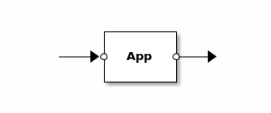
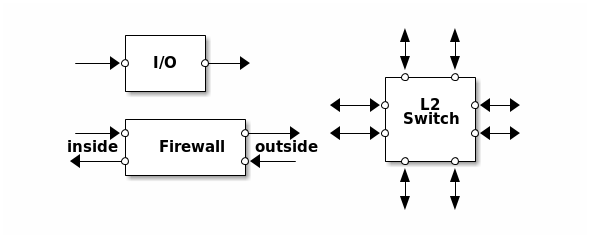
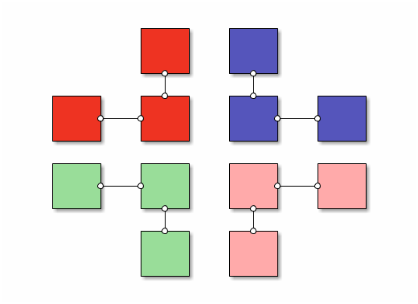

## Snabb Switch in a Nutshell

Snabb Switch is an open source project for simple and fast packet
networking. Here is what you should know about its software
architecture.

### Apps

*Apps* are the fundamental atoms of the Snabb Switch universe. Apps
are the software counterparts of physical network equipment like
routers, switches, and load generators.

*Links* are how you connect apps together. Links in turn are the
software counterparts of physical ethernet cables. With one important
difference: links are unidirectional while ethernet cables are
bidirectional, so you need a pair of links to emulate an ethernet
cable.

Apps can be connected with any number of input and output links and
each link can either be named or anonymous.

The name "app" is supposed to make you think of an App Store on your
mobile phone: an element in a collection of fixed-purpose components
that are easy for developers to distribute and for users to install.

Each app is a "black box" that receives packets from its input links,
processes the packets in its own peculiar way, and transmits packets
on its output links. Snabb Switch developers write new apps when they
need new packet processing functionality. An app could be an I/O
interface towards a network card or a virtual machine, an ethernet
switch, a router, a firewall, or really anything else that can receive
and transmit packets.

   
### App networks

To solve a networking problem with Snabb Switch you connect apps
together to create an *app network*.

For example, you could create a inline ("bump in the wire") firewall
device by taking two apps that perform I/O (e.g. 10G ethernet drivers)
and connecting them together via a firewall app that performs packet
filtering.

The app network executes as a simple event loop. On each iteration it
receives a batch of approximately 100 packets from the I/O sources and
then drives them through the network to their ultimate destinations.
Then it repeats. This is practical because the whole batch of packets
can fit into the CPU cache at the same time and each app can use the
CPU for a reasonable length of time between "context switches".

The performance and behavior of each app is mostly independent of the
others. This makes it possible to make practical estimates about
system performance when designing your app network. For example, if
your I/O apps require 50 CPU cycles and your firewall app requires 100
CPU cycles then you would spend 200 cycles per packet and expect to
handle 10 million packets per second (Mpps) on a 2GHz CPU.

You can also run multiple app networks in parallel. These each run as
an independent process and each use one CPU core. If you want 200 Mpps
performance then you can run 20 of your firewall app networks each on
a separate CPU core. (Your challenge will be to dispatch traffic to
the processes by some suitable means, for example assigning separate
hardware NICs to each process.)

Separate app networks can pass traffic between each other by simply
using apps that perform inter-process I/O. This is like having a
physical cluster of network devices that are cross-connected with
ethernet links. Generally speaking you can approach app network design
problems in the same way you would approach physical networks.

### Programs

Programs are shrink-wrapped applications built on Snabb Switch. They
are front ends that can be used to hide an app network behind a simple
command-line interface for an end user. This means that only system
designers need to think about apps and app networks: end users can use
simpler interfaces reminiscent of familiar tools like tcpdump, netcat,
iperf, and so on.

Snabb Switch uses the same trick as BusyBox to implement many programs
in the same executable: it behaves differently depending on the name
that you use to invoke it. This means that when you compile Snabb
Switch you get a single executable that supports all available
programs. You can choose a program with a syntax like `snabb
myprogram` or you can `cp snabb /usr/local/bin/myprogram` and then
simply run `myprogram`.

You can browse the available programs and their documentation in
[src/program/](https://github.com/SnabbCo/snabbswitch/tree/master/src/program).
You can also list the programs included with a given Snabb executable
by running `snabb --help`.

### Summary

Now you know what Snabb Switch is about!

The Snabb Switch community is now busy creating apps, app networks,
and programs. Over time we are improving our tooling and experience
for the common themes such as regression testing, benchmarking, code
optimization, interoperability testing, operation and maintenance
("northbound") interfaces, and so on. This is a lot of fun and we look
forward to continuing this for many years to come.
